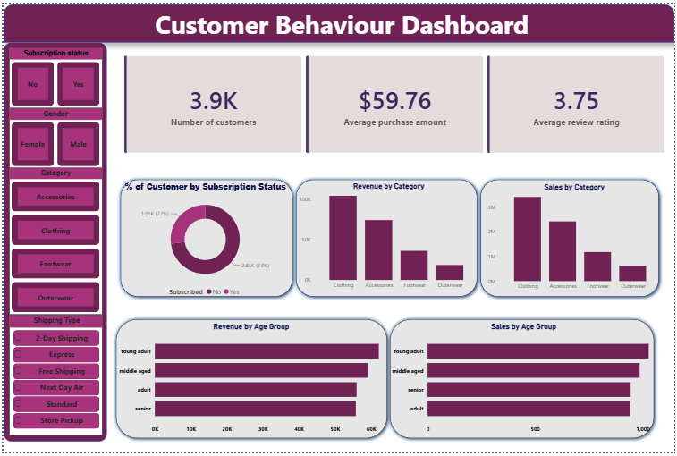

# Customer Behaviour Analysis

A data analytics project focused on understanding customer purchasing behaviour, spending patterns, and engagement trends using structured data analysis techniques.

The project analyzes customer-level data to generate actionable business insights that help improve retention strategies, identify high-value customers, and optimize marketing decisions.

Core Focus: Transform raw customer data into meaningful behavioural insights for business intelligence and decision-making.

---

## Project Overview

This project performs customer behaviour analysis using a single dataset/file (`customer.pbix`). The analysis focuses on extracting patterns related to customer activity, spending habits, and segmentation.

The workflow includes:

- Data inspection and cleaning  
- Exploratory data analysis (EDA)  
- Behavioural pattern identification  
- Customer segmentation logic  
- Insight generation for business use cases  

---

## Key Analysis Areas

### Customer Behaviour Insights
- Purchase frequency analysis  
- Spending pattern evaluation  
- High-value customer identification  
- Customer engagement trends  

### Business Intelligence Output
- Identification of loyal customers  
- Detection of low-engagement customers  
- Revenue contribution insights  

---

## File Information

- `customer.pbix` → Main dataset used for all analysis and insights generation  

---

## Dashboard Preview

---

## Tech Stack

| Component       | Technology Used |
|----------------|----------------|
| Data Analysis  | Python |
| Data Handling  | Pandas, NumPy |
| Visualization  | Matplotlib, Seaborn (optional) |

---

## How to Use

1. Clone the repository  
2. Load `customer.pbix` into your analysis environment  
3. Run your analysis scripts/notebooks  
4. View insights and dashboard outputs  

---

## License

This project is intended for educational and portfolio use only.
